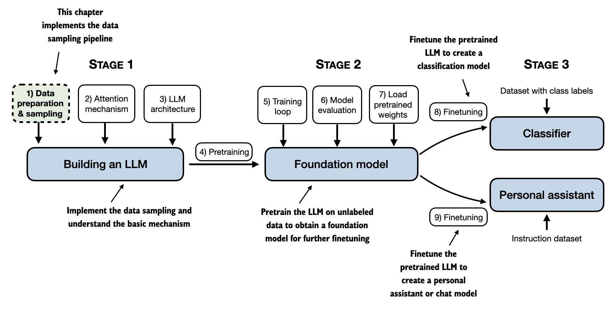
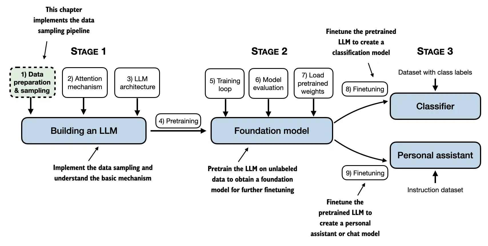

# Test various image rendering on GitHub

## PNG with HTML tag, URL link

## JPEG with HTML tag, URL link

## WEBP with HTML tag, URL link

## PNG with Markodwn syntax, URL link

## JPEG with Markodwn syntax, URL link

## WEBP with Markodwn syntax, URL link

## PNG with HTML tag, local link

## JPG with HTML tag, local link

## WEBP with HTML tag, local link

## PNG with Markodwn syntax, local link

## JPEG with Markodwn syntax, local link

## WEBP with Markodwn syntax, local link

